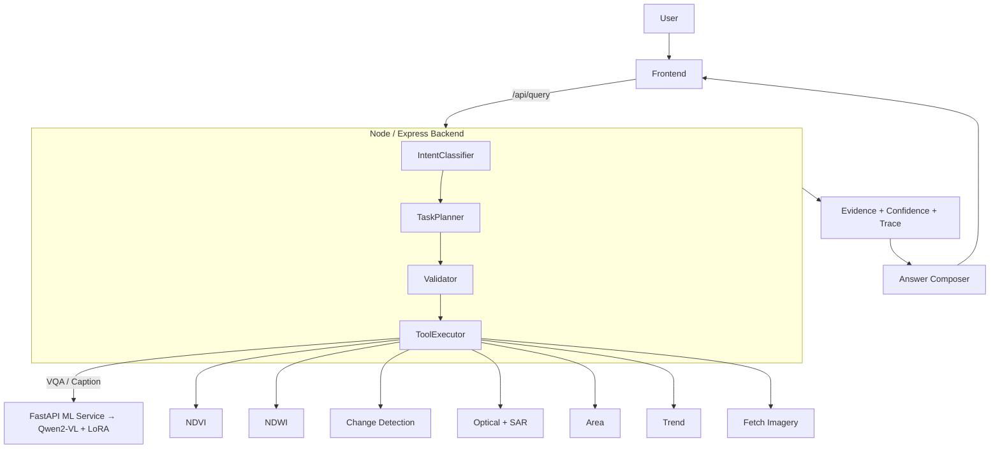

# SatQuery AI

**SatQuery AI converts natural-language questions into an executable remote-sensing workflow.**

Ask a question in plain English, attach satellite imagery (or a region of interest), and SatQuery AI classifies the intent, plans the tools, runs deterministic geospatial operations and a vision-language model, and returns an explainable answer with its execution trace.

[](https://react.dev)
[](https://nodejs.org)
[](https://www.python.org)
[](https://fastapi.tiangolo.com)
[](https://www.mongodb.com)

---

## Overview

SatQuery AI is an **Earth-intelligence question-answering platform** that couples a vision-language model (VLM) with deterministic geospatial tools. Users can ask about a single image, compare two dates to detect change, fuse optical and SAR data, compute spectral indices such as NDVI/NDWI, measure areas, or fetch imagery for a region.

The system is built as three cooperating services:

| Service | Folder | Role |
|---|---|---|
| Frontend | `frontend/` | React 19 + Vite app with a Cesium globe, evidence panel, trend chart, and PWA support |
| Backend | `backend/` | Node.js/Express orchestrator — agent pipeline, routing, validation, session history, tiles |
| ML service | `ml-service/` | Python 3.11 FastAPI — geospatial/raster computation and Qwen2-VL inference (VQA + captioning) |

### Design principle

> **Model samajhta hai. Agent decide karta hai. Tools calculate karte hain. Backend sabko orchestrate karta hai. Frontend evidence aur result dikhata hai.**

*(The model understands. The agents decide. The tools calculate. The backend orchestrates everything. The frontend shows the evidence and the result.)*

---

## How it works

Every query flows through the same pipeline:

```
User query / image
        │
        ▼
Intent classification ──► Task planning ──► Input validation
                                              │
                                              ▼
                                          Tool execution
                                              │
                                              ▼
                          Evidence aggregation + Confidence estimation
                                              │
                                              ▼
                                          Answer composition
                                              │
                                              ▼
                            Explainable result + execution trace
```

### Separation of perception from computation

We separate perception from computation: the VLM handles visual-language understanding, while deterministic geospatial tools handle operations such as indices, change, area, and sensor fusion.

- **Intent classification** decides *what* the user is asking (VQA, caption, change, optical+SAR, NDVI/NDWI, area, trend…). With an LLM API key configured it uses an LLM tool call; without one it falls back to a deterministic local heuristic.
- **Task planning** turns the intent into an ordered plan with explicit dependencies (e.g. `fetch-imagery → ndvi`, or `change → area`) using the registered tool registry.
- **Input validation** checks that the uploaded tiles match what the task needs. Rasters are validated by the ML service (`/validate`) for georeferencing, CRS, dimensions, and bands where applicable.
- **Tool execution** calls each registered tool — deterministic geospatial endpoints on the ML service, or VLM endpoints for visual understanding — and streams files as multipart uploads.
- **Evidence + confidence** aggregates the images/regions/notes each tool produced, and combines per-tool confidence signals into a single heuristic score.
- **Answer composition** writes the final human-readable answer using the evidence, and the full execution trace is returned with the result.

---

## Features

- **Natural-language querying of satellite imagery** — ask questions about a single image or compare image pairs.
- **Vision-language understanding** — Qwen2-VL (2B) processes image + text together for VQA and captioning, with PEFT/LoRA adaptation.
- **Deterministic geospatial tools** — NDVI/NDWI, bi-temporal change detection, optical+SAR fusion, area measurement, raster validation, and regional imagery acquisition.
- **Explainable results** — each response exposes the tool(s) used, status, evidence, per-tool confidence, metadata, and the full execution trace.
- **Session-scoped history** — query results are persisted in MongoDB and filtered by session.
- **3D globe UI** — Cesium-based globe with ROI drawing, basemap switching, and OSM Nominatim search/reverse-geocoding.
- **PWA support** — installable and offline-capable via `vite-plugin-pwa`.
- **Graceful demo mode** — when live dependencies are unavailable, responses are clearly labelled as mock/offline placeholders (never presented as real analysis).

---

## Tech stack

| Layer | Technology |
|---|---|
| Frontend | React 19, Vite 8, Cesium, GSAP, Framer Motion, @paper-design/shaders-react, Tailwind CSS 4, react-router, native `fetch`, OSM Nominatim, vite-plugin-pwa |
| Backend | Node.js 20, Express 4, MongoDB/Mongoose, JWT + bcrypt (auth infrastructure), Multer, Anthropic + OpenAI SDKs, Jest/Supertest |
| ML service | Python 3.11, FastAPI, Uvicorn, PyTorch, Transformers, PEFT, Accelerate, qwen-vl-utils, Rasterio, NumPy, PyProj, Shapely, Pillow, earthengine-api (lazy import) |
| Model | Qwen2-VL-2B-Instruct (base) + LoRA adapter |
| Deployment | Docker / docker-compose (mongodb + ml + backend) |

### Frontend highlights

- Cesium globe view with ROI rectangle drawing, geocoding via OpenStreetMap **Nominatim** (`/search` and `/reverse`), and multiple OSM base layers.
- Motion and visual polish via **GSAP**, **Framer Motion**, and **shaders-react**.
- Native browser `fetch` client in `frontend/src/services/api.js` — no HTTP library dependency.
- PWA: service worker + web manifest registered at build time.

---

## ML / VLM details

### Vision-language model

SatQuery AI's core visual-language model is **Qwen2-VL-2B-Instruct** (`Qwen/Qwen2-VL-2B-Instruct`). It is a **Transformer-based vision-language model** (a Qwen2-2B LLM decoder extended with a vision encoder), not a traditional ML algorithm such as Random Forest or SVM. It receives an image together with a natural-language question and generates a short answer (VQA) or a descriptive sentence (caption).

- VQA endpoint returns **RSVQA-style** short answers (e.g. `yes`, `no`, `3`, `farmland`).
- Caption endpoint returns **VRSBench-style** natural English sentences.
- On CPU the model runs in `float32`; on CUDA it uses `bfloat16`.
- If PyTorch/model weights are missing, endpoints return an **explicitly labelled offline placeholder** (`metadata.mock=true`, `offline=true`, `confidence=0.0`) — never a fabricated model result.

### LoRA adaptation

The model is adapted with **PEFT/LoRA** (parameter-efficient fine-tuning), so only small adapter weights are trained on top of the frozen base model.

The live serving adapter is `ml-service/adaptation/final_adapter`. Its configuration is:

| Setting | Value |
|---|---|
| Base model | `Qwen/Qwen2-VL-2B-Instruct` |
| PEFT type | `LORA` |
| Rank (`r`) | `16` |
| Alpha (`lora_alpha`) | `32` |
| Dropout (`lora_dropout`) | `0.05` |
| Target modules | `q_proj`, `v_proj` (self-attention in the LLM decoder) |

The adapter is loaded with `PeftModel.from_pretrained(base_model, adapter_path)` at warmup/inference. In Docker it is baked into the image at `/app/adaptation/final_adapter` and exposed to the ML service via `VQA_ADAPTER_PATH`.

### Why a vision-language model?

> Traditional text-only LLMs are not designed to directly process image pixels. SatQuery's core input combines satellite imagery with natural-language questions, so a vision-language model is a better fit for image understanding.

### Why not let the model calculate everything?

> Geospatial quantities should come from deterministic raster operations for reproducibility and verifiability rather than being guessed by a language model.

---

## Geospatial tools

The backend maintains a **tool registry** (`backend/src/services/seedTools.js`, persisted in MongoDB). The executor calls each tool's ML-service endpoint and streams uploaded files as multipart requests.

| Tool | Endpoint | What it does |
|---|---|---|
| `vqa` | POST `/vqa` | Answer a question about the image with the VLM (LoRA adapter active) |
| `caption` | POST `/caption` | Generate a natural-language caption of the image |
| `ground` | `ground` (registered) | Locate/highlight a target. **Not backed by a live ML endpoint — the backend returns a clearly labelled mock bounding box, never real grounding** |
| `change` | POST `/change` | Bi-temporal change detection between a T1/T2 raster pair |
| `optical_sar` | POST `/optical-sar` | Cross-modal optical + SAR fusion / multi-sensor analysis |
| `ndvi` | POST `/ndvi` | Normalized Difference Vegetation Index from optical bands |
| `ndwi` | POST `/ndwi` | Normalized Difference Water Index from optical bands |
| `area` | POST `/area` | CRS/resolution-aware surface-area measurement of valid pixels |
| `trend` | POST `/trend` | Historical time-series trend for a region + metric (NDVI/NDWI) |
| `validate` | POST `/validate` | Validate an uploaded raster and extract structured metadata (used at upload time) |
| `fetch-imagery` | POST `/fetch-imagery` | Acquire a co-registered optical + SAR pair for a region (Google Earth Engine provider) |

### Deterministic tools

Deterministic tools perform fixed mathematical/geospatial operations rather than guessing:

- **NDVI / NDWI** use band mathematics over red/NIR and green/NIR bands respectively.
- **Change detection** aligns the two rasters, computes pixel-level differences, and applies a threshold (a deterministic **2-sigma** default when none is given).
- **Area** computes surface area from raster resolution and CRS (never `deg × deg`); changed-area can be derived directly from the change tool's pixel statistics.
- **Validation** checks raster inputs for georeferencing, CRS, dimensions, bands, and can reject inputs it cannot reason about.

Not every tool is deterministic: `vqa` and `caption` are VLM inference, and `trend`/`fetch-imagery` depend on a Google Earth Engine data provider (mock/dev otherwise).

### Optical + SAR

- **Optical imagery** provides spectral reflectance information (multispectral/RGB).
- **SAR imagery** provides radar backscatter and structural/moisture-related information, and can operate day/night and through cloud cover.
- The system is **sensor-aware**: `optical_sar` fuses an optical raster and a SAR raster (including a deterministic speckle-reduction step).
- **Genuine fusion requires suitable, georeferenced optical and SAR raster inputs** with compatible spatial extent/CRS. Uploaded PNG/JPEG files without georeferencing may be rejected by validation.
- Arbitrary PNG/JPEG images are **not** genuine georeferenced satellite rasters; the system never presents them as such.

### Change detection

- T1 and T2 rasters are validated, checked for georeference compatibility, and **aligned/co-registered** when needed before comparison.
- Pixel-level absolute differences are computed over valid (non-nodata, overlapping) pixels.
- Automatic thresholding defaults to a **two-sigma** (2× standard deviation of valid differences) approach; an explicit threshold can be supplied.
- The UI presents "major change" only as a **presentation heuristic** — it is not a universal/scientific fixed threshold.
- Only pixel-level change is measured; the system does **not** invent semantic labels (e.g. "flood", "deforestation") from the difference statistics.

---

## Evidence & explainability

Every pipeline response is structured to be inspectable. Results expose:

- **tool used** — which registered tool(s) ran, in order
- **status** — `success`, `partial`, `failed`, `rejected`, `skipped`
- **evidence** — referenced image/tile IDs, region, and aggregated notes
- **confidence** — per-tool and overall
- **metadata** — filename, size, model, `adapter_used`, mock/offline flags, data source
- **execution trace** — ordered, timestamped entries from intent classification to answer composition
- **input/source information** where available (tile modality, source, capture date, CRS, bands)

The frontend renders the answer alongside the evidence panel, including model/adapter status (e.g. `LoRA Adapter: Active`).

### Confidence

> Confidence is a heuristic reliability signal, not a calibrated probability and not the same as model accuracy.

It combines deterministic per-tool reliability scores (e.g. change detection with warnings scores lower than a clean direct comparison) with VLM output-structure heuristics and pipeline signals (validation warnings, failed/skipped tools, missing data, co-registration). It indicates how much the pipeline *trusts* its own result, not how accurate it is.

---

## Mock / fallback behaviour

SatQuery AI is honest about fallbacks. Any result that is **not** real satellite analysis is explicitly labelled in metadata and/or the UI:

- **Backend offline fallback** — if the ML service is unreachable or times out, the backend returns a labelled mock response with `metadata.mock: true`.
- **ML offline placeholder** — VQA/caption return `offline-placeholder` with `mock: true, offline: true, confidence: 0.0` when PyTorch/weights are unavailable.
- **Trend/fetch-imagery mock mode** — when `GEE_MODE` is empty or GEE credentials are absent, results are labelled with `metadata.data_source` (`mock`) and explicit warnings.
- **Demo precompute** — for an explicitly configured demo region, a precomputed trend fallback can be served with `isDemoPrecompute` / `cache.source: 'demo-precompute'`.
- Mock-labelled trend results are **never cached** as real data.

---

## Demo flow

The following prepared queries work in the demo UI (after uploading imagery):

1. **Single-image VQA**
   > "Is there a body of water visible in this image?"

2. **Temporal (change detection)**
   > "Detect and explain the major changes between T1 and T2."

3. **Optical + SAR**
   > "Analyze this scene using both optical and SAR imagery and explain the key observations."

> **For live judging**: temporal and Optical + SAR workflows use genuine bi-temporal / cross-sensor analysis, so **prepared, valid georeferenced raster inputs** (GeoTIFF pairs, and one optical + one SAR raster) should be used for genuine results. Plain PNG/JPEG screenshots without georeferencing will be flagged by validation.

---

## Judge-friendly architecture



### Key architectural separation

**"We separate perception from computation: the VLM handles visual-language understanding, while deterministic geospatial tools handle operations such as indices, change, area, and sensor fusion."**

- The **model** reads images/answers in natural language.
- The **agents** (classifier, planner, validator, executor, confidence estimator, composer) decide and orchestrate.
- The **tools** produce reproducible numeric results from raster math.
- The **frontend** displays both the answer and the evidence that supports it.

---

## Setup (local development)

### Prerequisites

- Node.js (the backend Docker image is `node:20-alpine`)
- Python 3.11 (the ML Docker image is `python:3.11-slim`)
- MongoDB running locally (`mongodb://localhost:27017/satquery` by default)

### 1. ML service

```bash
cd ml-service
source .venv/bin/activate
python3 -m uvicorn app.main:app --host 127.0.0.1 --port 8000
```

The service exposes `http://localhost:8000/health` when ready. VLM inference requires the model weights (and for VQA, the LoRA adapter at `adaptation/final_adapter`); without them the endpoints return explicitly labelled offline placeholders.

### 2. Backend

```bash
cd backend
PORT=5010 ML_SERVICE_BASE_URL=http://localhost:8000 node src/index.js
```

MongoDB must be reachable (override with `MONGODB_URI` if needed). The backend listens on port `5010` with these environment overrides and proxies file/raster calls to the ML service.

### 3. Frontend

```bash
cd frontend
npm install
npm run dev
```

The Vite dev server proxies `/api` to `http://localhost:5010` (configured in `frontend/vite.config.js`), so the frontend reaches the backend through Vite's `/api` proxy.

Alternatively, run the full stack with Compose:

```bash
docker compose up -d --build --wait
```

### Environment variables

`.env` files should remain **local and uncommitted** (the repo's `.gitignore` excludes `.env`). Only variable *names* are listed here — never put real values or secrets in this repo.

| Service | Variable | Purpose |
|---|---|---|
| ML | `PORT`, `HOST`, `NODE_ENV` | Server binding |
| ML | `VLM_MODEL`, `VQA_MODEL`, `CAPTION_MODEL` | Model IDs (default `Qwen/Qwen2-VL-2B-Instruct`) |
| ML | `VQA_ADAPTER_PATH`, `CAPTION_ADAPTER_PATH` | LoRA adapter paths for VQA/caption |
| ML | `GEE_MODE`, `GEE_PROJECT_ID`, `GEE_SERVICE_ACCOUNT`, `GEE_SERVICE_ACCOUNT_KEY_PATH` | Google Earth Engine (empty = labelled mock/dev mode) |
| Backend | `PORT`, `MONGODB_URI`, `NODE_ENV` | Server, database, environment |
| Backend | `JWT_SECRET` | JWT signing secret (auth infrastructure) |
| Backend | `ML_SERVICE_BASE_URL`, `ML_SERVICE_TIMEOUT_MS` | ML service connectivity (default timeout 600000 ms for CPU inference) |
| Backend | `LLM_API_KEY`, `LLM_PROVIDER` | LLM for intent classification/answer composition (`anthropic`/`openai`); unset ⇒ deterministic heuristic |
| Backend | `DEMO_TREND_REGION`, `DEMO_TREND_METRIC`, `DEMO_TREND_INTERVAL`, `DEMO_TREND_START_DATE`, `DEMO_TREND_END_DATE`, `DEMO_TREND_TTL_DAYS` | Optional demo-region trend precompute fallback |
| Frontend | `VITE_API_BASE_URL` | Backend base URL in development (default `http://localhost:5010`) |

**Never commit `.env`, credentials, API keys, or secrets.**

---

## API / services

### ML service (FastAPI) — `ml-service/app/api`

| Method | Path | Purpose |
|---|---|---|
| GET | `/health` | Health check |
| POST | `/validate` | Raster validation + metadata extraction |
| POST | `/vqa` | VQA inference (image file + question) |
| POST | `/caption` | Image captioning |
| POST | `/vlm/warmup` | Pre-load base model + LoRA into memory (idempotent) |
| POST | `/ndvi` | NDVI computation |
| POST | `/ndwi` | NDWI computation |
| POST | `/area` | Surface-area measurement |
| POST | `/change` | Bi-temporal change detection (image1/image2, optional threshold/band) |
| POST | `/optical-sar` | Optical + SAR fusion (optical_image/sar_image) |
| POST | `/trend` | Historical trend for a region/metric (GEE provider) |
| POST | `/fetch-imagery` | Region-based optical + SAR acquisition (GEE provider) |

### Backend (Express) — `backend/src`

| Method | Path | Purpose |
|---|---|---|
| GET | `/health` | Health check |
| POST | `/api/auth/register` | Create a user (JWT + bcrypt). Auth infrastructure exists; no route currently requires it |
| POST | `/api/auth/login` | Log in, receive a JWT |
| POST | `/api/images/upload` | Upload up to 5 images (multipart `images`), validates, stores tiles |
| POST | `/api/images/fetch-by-region` | Acquire optical + SAR pair for a GeoJSON bounding box |
| GET | `/api/tiles/:id` | Tile metadata (modality, format, CRS, bands, renderability) |
| GET | `/api/tiles/:id/image` | Serve tile source bytes (PNG/JPEG only; TIFF rejected with a labelled error) |
| POST | `/api/query` | Main entry point: `{ queryText, imageRefs[], parameters, sessionId }` → pipeline response |
| GET | `/api/query/history` | Session-scoped query history |
| POST | `/api/query/trend` | Historical trend query with two-phase result caching |
| GET | `/api/query/:id` | Fetch a persisted query result |
| GET | `/api/query/:id/report` | Fetch an explainability report for a query |
| GET | `/api/tools` | Registered tool list from the tool registry |
| POST | `/api/ml/warmup` | Fire-and-forget VLM warmup proxy to the ML service |

Pipeline responses include `answerText`, `taskType`, `plan`, `toolResults`, `evidence`, `confidence`, `confidenceSignals`, `executionTrace`, and `status`.

---

## Research / Experiment: BigEarthNet

This section documents **experimental** work — it is not the serving path.

BigEarthNet adaptation lives in `ml-service/adaptation/` (`bigearthnet_dataset.py`, `train_lora_bigearthnet.py`). It builds on the same Qwen2-VL-2B-Instruct base and LoRA recipe, using two RGB composites (Sentinel-2 false-color + Sentinel-1 composite) per sample from the official BigEarthNet v2.0 data (parquet + Encoded-BigEarthNet LMDB), with a patch-level no-leakage train/eval split.

> We completed a controlled 500-step BigEarthNet LoRA adaptation experiment on a small selected evaluation set. On that selected 8-sample evaluation, the base model scored 0%, while the adapted model scored 25%. This is a prototype result, not a full benchmark claim.

Honest caveats:

- The result is a **prototype, small-sample result**, not a full benchmark. A single 8-sample evaluation set is far too small to generalise from, and small evaluation sets can overfit.
- The evaluation metric is a lightweight repository-level exact-match (lowercased), not an NLB/benchmark-grade protocol.
- **The BigEarthNet-trained experimental checkpoint is not the currently deployed/serving adapter.** The live serving adapter is `ml-service/adaptation/final_adapter`, which serves the `/vqa` endpoint.

---

## Live VQA verification

The serving path has been verified with:

- **Model:** Qwen2-VL-2B-Instruct
- **LoRA adapter:** active (`final_adapter`)
- **Inference:** live `POST /vqa` inference
- **Signal:** `adapter_used=true` in the response metadata

No additional accuracy numbers are claimed.

---

## Limitations

- **CPU inference latency.** VLM inference on CPU is slow (measured roughly ~200 s cold / ~117 s warm for Qwen2-VL + LoRA); the warmup endpoint mitigates the cold-start for a live demo.
- **Small experimental evaluation** is not a full benchmark and can overfit.
- **Confidence is heuristic**, not a calibrated probability.
- **Real Optical + SAR fusion requires georeferenced, compatible raster inputs.** Plain uploads without georeferencing may be rejected by validation.
- **Grounding (`ground`)** is registered but not backed by a live ML endpoint; it returns a clearly labelled mock bounding box.
- **Production deployment** would require stronger authentication/authorization, a stricter CORS policy, rate limiting, managed secret handling, observability, and a GPU/batching/caching inference strategy, plus far more extensive evaluation.
- Some capabilities have **mock/demo fallbacks where explicitly indicated** in metadata and the UI.

---

## Security

- The current application is a **hackathon/prototype** deployment; it is **not fully production-secured**.
  - CORS is permissive (`cors()` / `allow_origins=["*"]`).
  - Auth (JWT/bcrypt) infrastructure exists, but backend routes currently accept anonymous access.
- **Credentials and secrets belong in environment variables and must never be committed.** `.env` files are git-ignored; never commit `.env`, API keys, tokens, or private service-account keys.
- The ML service reads credentials from the environment/`.env` (e.g. GEE service-account key path) and never from the repository. No `.env` is committed.

---

## Project structure

```
satQueryAI/
├── backend/                     # Node.js/Express orchestrator + agent pipeline
│   ├── src/
│   │   ├── agents/              # intentClassifier, taskPlanner, inputValidator,
│   │   │                        # toolExecutor, confidenceEstimator, answerComposer, pipeline
│   │   ├── middleware/          # auth middleware (optional)
│   │   ├── models/              # Mongoose models (Query, Tile, ToolRegistry, ResultsCache, User)
│   │   ├── routes/              # query, images, tiles, tools, auth, trend, ml, fetch-imagery
│   │   ├── services/            # db, mlServiceClient, demoTrendService, seedTools
│   │   └── utils/               # responseBuilder
│   ├── tests/                   # Jest + Supertest suites
│   └── scripts/                 # precompute-demo-trend
├── frontend/                    # React 19 + Vite app
│   ├── src/
│   │   ├── Components/          # GlobeView (Cesium), SearchBar, ResultsPanel, TrendChart, …
│   │   ├── landing/             # Landing/globe UI, auth forms, shaders
│   │   ├── lib/                 # results parsing, utils
│   │   └── services/api.js      # native-fetch API client
│   └── vite.config.js           # Vite proxy (/api → :5010), PWA, Cesium, Tailwind
├── ml-service/                  # Python 3.11 FastAPI — geospatial + VLM
│   ├── app/
│   │   ├── api/                 # validate, vqa, caption, ndvi, ndwi, area,
│   │   │                        # change, optical_sar, trend, fetch_imagery
│   │   ├── models/              # vlm_loader (Qwen2-VL + LoRA)
│   │   ├── tools/               # vqa, caption, change, fusion, ndvi, ndwi, area, trend, fetch_imagery
│   │   ├── geospatial/          # raster_io, crs, validation
│   │   ├── preprocessing/       # band_detection, normalize, speckle_filter, loader
│   │   └── services/            # gee_client (GEE provider, mock/dev mode)
│   ├── adaptation/              # LoRA fine-tuning (RSVQA + BigEarthNet) and final_adapter
│   │   └── final_adapter/       # SERVING adapter (adapter_config.json + safetensors)
│   └── tests/                   # pytest suite
├── scripts/                     # docker-smoke.sh
└── docker-compose.yml           # mongodb + ml + backend
```

---

## Testing

Repository-defined test commands (run inside each service directory):

| Service | Command | What it runs |
|---|---|---|
| Backend | `cd backend && npm test` | Jest + Supertest suites (`node --experimental-vm-modules node_modules/.bin/jest --runInBand`) — 24 suites covering the agent pipeline, fallbacks, caching, session history, and integration |
| ML service | `cd ml-service && source .venv/bin/activate && pytest` | pytest suite for APIs, raster I/O, validation, NDVI/NDWI, change, fusion, trend, fetch-imagery, and adaptation |
| Frontend | `cd frontend && npm run lint` | ESLint |
| Frontend | `cd frontend && npm run build` | Vite production build (also generates the PWA assets) |
| Full stack | `./scripts/docker-smoke.sh` (from repo root) | Compose build + health checks on mongodb/ml/backend + optional live query round-trip |

> Status note (verified in this repository): the ML-service `pytest` suite passes (285 tests). The backend `npm test` suite currently has 5 failing suites (32 tests) — the failures are pre-existing and unrelated to documentation (e.g. some trace-shape tests expect a `details` field while `makeTraceEntry` emits `detail`). Report them as-is rather than assuming "all green".

---

## Current demo status

- A full Compose stack (`mongodb`, `ml`, `backend`) is defined with per-service health checks; `scripts/docker-smoke.sh` builds it and verifies health end-to-end.
- The frontend ships a generated build (`frontend/dist`) and consumes the backend through the Vite `/api` proxy.
- With `LLM_API_KEY` **unset**, intent classification and answer composition use the deterministic local heuristic; with the ML service offline, tools return clearly labelled mock results (marked in metadata/UI).
- With model weights + LoRA adapter present, `/vqa` runs live Qwen2-VL inference with `adapter_used=true`.
- Trend/fetch-imagery run in labelled mock/dev mode without GEE credentials; real GEE acquisition requires configuring `GEE_*` credentials.

---

## Future work

- **GPU-backed inference** (Hugging Face Accelerate / batching / caching) to slash VLM latency.
- **Genuine Large-Scale Image/Video Download** — real Google Earth Engine integration for region-based acquisition and historical trends (currently mock/dev-labelled without credentials).
- **Full benchmark evaluation** — NLB-style evaluation for VQA/captioning (RSVQA-HR, VRSBench) and a scale-appropriate BigEarthNet adaptation study instead of the 8-sample prototype.
- **Production hardening** — real authentication/authorization on routes, strict CORS, rate limiting, secret management via a vault, observability (tracing/metrics/logging), and data-retention policy for uploaded imagery.
- **Expanded tooling** — quantized distil variants, SAR despeckling algorithms, segmentation/grounding via a vision model, and richer semantic change summarisation built on the pixel-level change statistics.